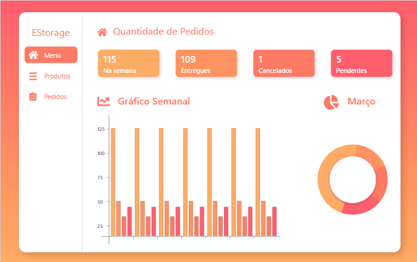
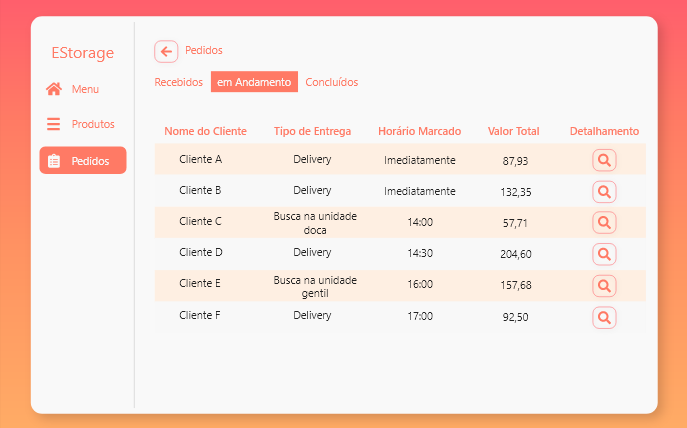
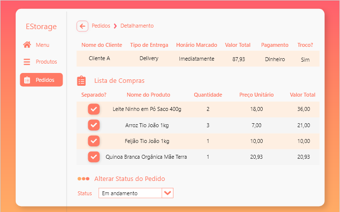
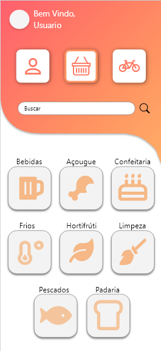
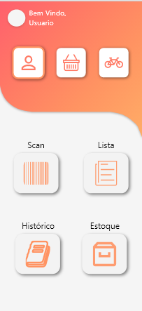
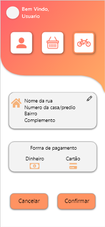

# E-Storage

## Definição do Produto

Criação de um aplicativo de estoque, listagem e compras, que possa auxiliar o usuário a ter o controle de suas compras de supermercado, assim como ter uma lista de compras sempre atualizada para não faltar nada na hora de fazer mais pedidos.

## Objetivo Geral

O produto visa ajudar nas compras e controle da dispensa de casa, com a criação de um sistema de estoque, listagem e delivery, trazendo praticidade na hora de realizar as compras periódicas da casa, fazendo assim uma ponte entre as famílias consumidoras e os mercados que realizam vendas em varejo, levando uma segurança a mais no período de pandemia em que vivemos.

## Interface

- Tela de Menu do Estabelecimento

- Tela de Pedidos do Estabelecimento

- Tela do Detalhamento dos Pedidos do Estabelecimento

- Tela de Produtos do Usuário

- Perfil do Usuário

- Delivery do Usuário

## Participantes

- Caroline Maria Nunes Bol - carolinemariabol@gmail.com
- Danilo Bezerra de Castro - daniiloo@gmail.com
- David Santos Cabral - davidcabral252001@gmail.com
- Isabela Sobral Porpino Paes Barreto - isabelasporpino@gmail.com
- Luiz Ricardo Bragança da Silva - lurbraganca@hotmail.com